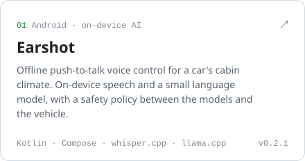
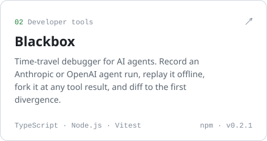
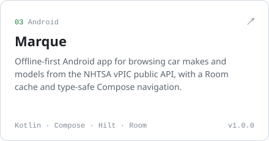
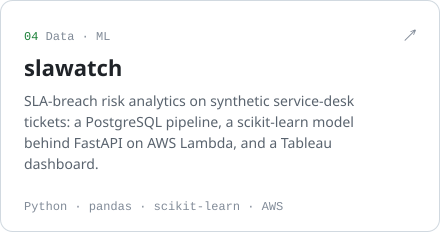
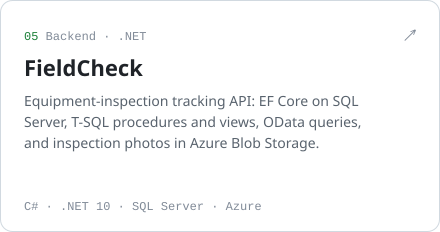
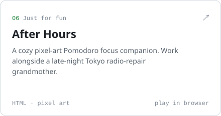

<picture>
  <source media="(prefers-color-scheme: dark)" srcset="assets/header-dark.svg">
  
</picture>

### Selected work

<a href="https://github.com/arda-ulas/earshot"><picture><source media="(prefers-color-scheme: dark)" srcset="assets/card-earshot-dark.svg"></picture></a>
<a href="https://github.com/arda-ulas/blackbox"><picture><source media="(prefers-color-scheme: dark)" srcset="assets/card-blackbox-dark.svg"></picture></a>
<a href="https://github.com/arda-ulas/marque"><picture><source media="(prefers-color-scheme: dark)" srcset="assets/card-marque-dark.svg"></picture></a>
<a href="https://github.com/arda-ulas/slawatch"><picture><source media="(prefers-color-scheme: dark)" srcset="assets/card-slawatch-dark.svg"></picture></a>
<a href="https://github.com/arda-ulas/fieldcheck"><picture><source media="(prefers-color-scheme: dark)" srcset="assets/card-fieldcheck-dark.svg"></picture></a>
<a href="https://arda-ulas.github.io/after-hours/"><picture><source media="(prefers-color-scheme: dark)" srcset="assets/card-after-hours-dark.svg"></picture></a>

### Experience

**Ford Motor Company** · Android HMI Software Developer Intern · Sep 2024 – Aug 2025

Built Kotlin and Jetpack Compose features in a multi-display Android Automotive codebase. Delivered a clock selection feature end to end, made a previously untestable UI area testable in CI with custom Robolectric shadows, and traced a compass heading error from the widget down into the C++ HAL.

**Queen's University** · Bachelor of Computing (Honours), Software Design · 2022 – 2026

### Toolbox

**Languages** &nbsp; Kotlin · Java · TypeScript · Python · C# · SQL · C++ 
**Android** &nbsp; Jetpack Compose · Coroutines/Flow · Hilt · Room · Retrofit · Robolectric · Android Automotive 
**On-device AI** &nbsp; whisper.cpp · llama.cpp · GGUF models · JNI/NDK 
**Backend and data** &nbsp; Node.js · FastAPI · ASP.NET Core · PostgreSQL · SQL Server · pandas · scikit-learn 
**Cloud and tooling** &nbsp; AWS Lambda · Azure · Docker · GitHub Actions · Gradle · Git

### Off the clock

Shooting street and travel photos on a manual film camera, playing guitar with friends, and following Arsenal. On rotation: Oasis, Fleetwood Mac, Eagles, Radiohead.

### Contact

[LinkedIn](https://www.linkedin.com/in/ozdemirarda)
